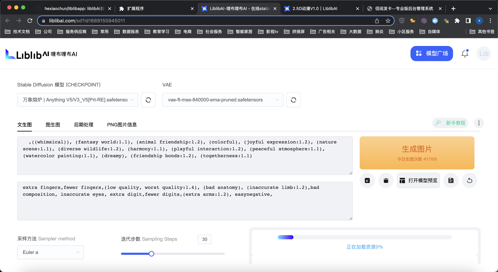
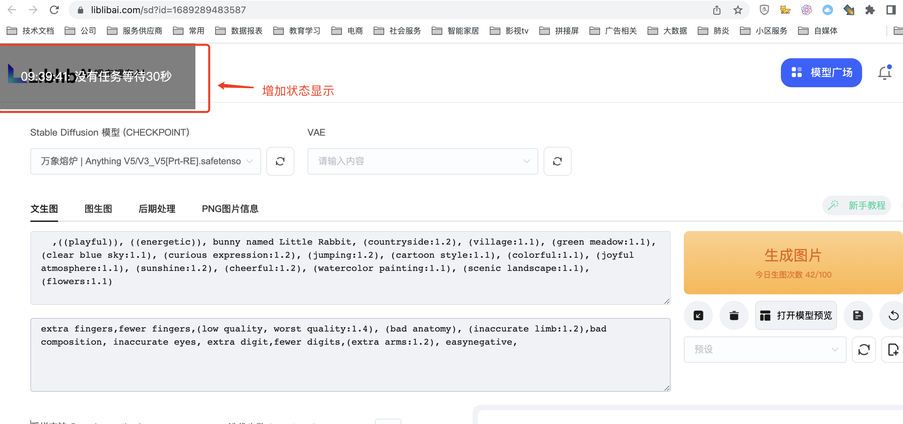
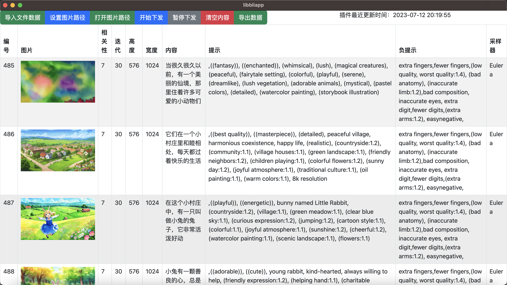

## 1、在浏览器导入浏览器插件

## 2、打开liblibai.com的画图地址




## 3、启动本地软件


## 4、导入批量任务，开始下发

## 5、自动下发作图

## 6、多开浏览器的方法

"/Applications/Microsoft Edge.app/Contents/MacOS/Microsoft Edge" --user-data-dir="~/edge1" --no-first-run &
"/Applications/Microsoft Edge.app/Contents/MacOS/Microsoft Edge" --user-data-dir="~/edge2" --no-first-run &
"/Applications/Microsoft Edge.app/Contents/MacOS/Microsoft Edge" --user-data-dir="~/edge3" --no-first-run &

**1. 通过命令行启动新的浏览器进程**

这种方法稍微复杂一点，但是可以让你更灵活地控制浏览器的启动和运行。

1. 打开“应用程序”文件夹，找到Edge浏览器，然后右键点击选择“显示包内容”。

2. 打开"Contents" > "MacOS"文件夹，记住里面的"Microsoft Edge"文件的路径。

3. 打开“终端”应用，输入以下命令并回车：
```bash
"/path/to/Microsoft Edge" --user-data-dir="/path/to/new/directory" --no-first-run &
```
请将上述命令中的"/path/to/Microsoft Edge"替换为实际的"Microsoft Edge"文件路径，将"/path/to/new/directory"替换为你想要存储新的用户数据的目录路径。

注意，每次使用不同的"--user-data-dir"参数，都会启动一个新的浏览器进程，从而打开新的浏览器窗口。

希望以上的信息对你有所帮助！


在 Windows 电脑上多开 Edge 浏览器的方法，和 Mac 的方法相类似

**1. 通过命令行启动新的浏览器进程**

这种方法稍微复杂一些，但是它可以让你更灵活地控制浏览器的启动和运行。

1. 按 `Win+R` 打开运行对话框，输入 `cmd` 并按回车，这样可以打开命令提示符窗口。

2. 在命令提示符中输入以下命令并回车：

```bash
start msedge.exe --user-data-dir="C:\path\to\new\directory" --no-first-run
```

请将上述命令中的 "C:\path\to\new\directory" 替换为你想要存储新的用户数据的目录路径。注意，每次使用不同的 "--user-data-dir" 参数，都会启动一个新的浏览器进程，从而打开新的浏览器窗口。

这两种方法都可以让你在 Windows 电脑上多开 Edge 浏览器，你可以根据自己的需要选择使用哪一种。


## 图文教程

https://snvazev2ds.feishu.cn/docx/MlKrdrjJfoRey0xun33chtoOnye


## mac电脑提示文件损坏的处理方式

sudo xattr -d com.apple.quarantine /Applications/libbliapp.app

## 软件下载地址
https://github.com/hexiaochun/liblibapp/releases/tag/v1.0.0

## 代码编译

npm install 

npm run watch
